# How to map courses

## Setup

#### Sign up for an account at OpenStreetMap

Hacker Yardage uses data from OpenStreetMap to make yardage books. In order to map your courses, you'll need to [sign up for an account](https://www.openstreetmap.org/user/new). The introduction will include a brief tutorial to get you familiar with the software.

#### Find the golf course you want to map

You can use the search function on OpenStreetMap, but not every course will show up if you search by name - so you may need to find the course's address and search for that.

## Mapping holes

#### Step 1: Define the hole's waypoints

*Note: this is the most important step of mapping. The Hacker Yardage tool uses these waypoints to define where each hole is located, and also to measure distances to the green.*

To get started, click the ```Edit``` button in OSM. You'll see satellite imagery come up to help you with the mapping. Navigate to the first hole of your course:

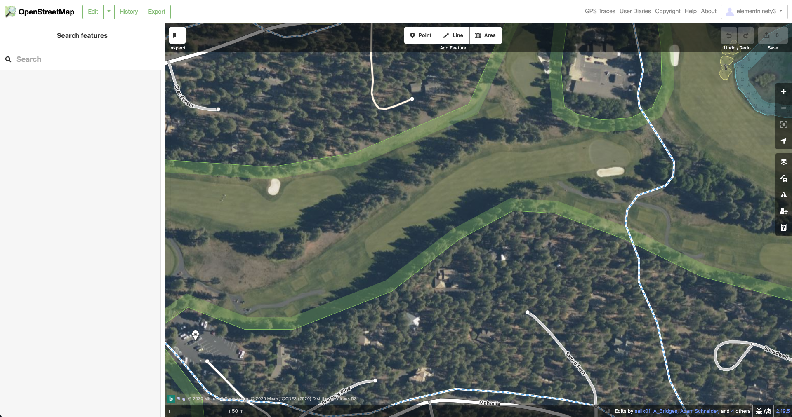

To add waypoints for a hole, click on the ```Line``` button at the top of the screen:

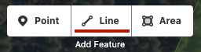

Place your first point on the hole's furthest back tee box (the "tips"). *(Order matters - you must enter these points from tee to green.)*

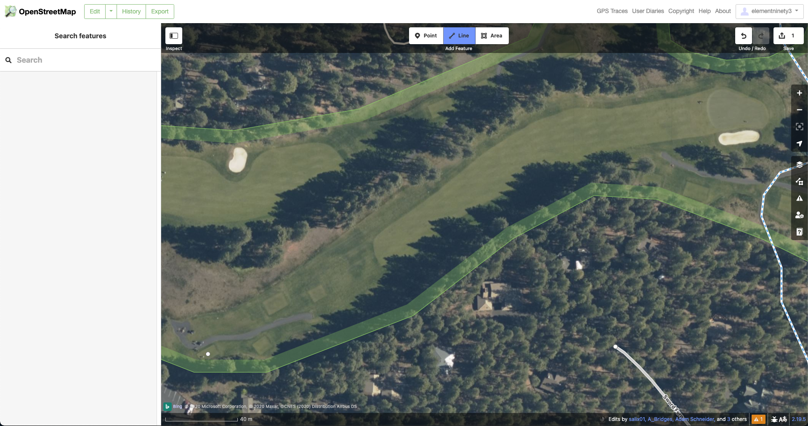

For doglegs, you can place an intermediate point (or two) to define the hole's route. (Don't add more than 4 points per hole. It's fine to use just 2 points for par 3s and straight par 4s.)

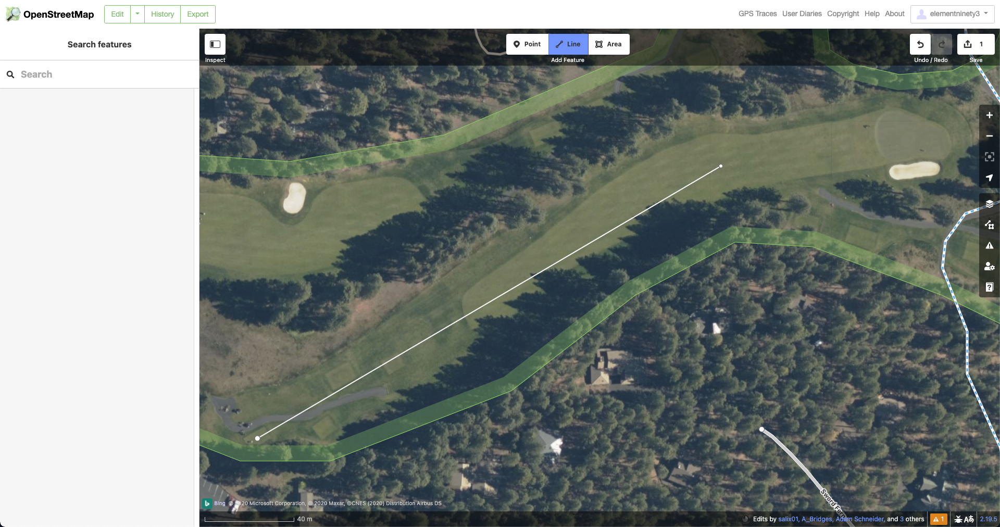

Next, place your last point in the center of the green. *(This point is where all distances will be measured to in your yardage book - place it where you think the 'center of the green' should be.)*


Finally, now that you've created the waypoints for this hole, we need to add some overview information. First, select "Golf Hole" as the feature type:

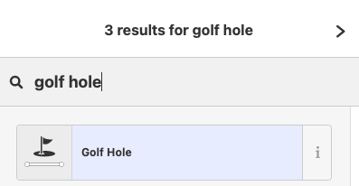

Next, enter the hole's number and par on the left side of the screen. You can also add an optional description, but it's not required.

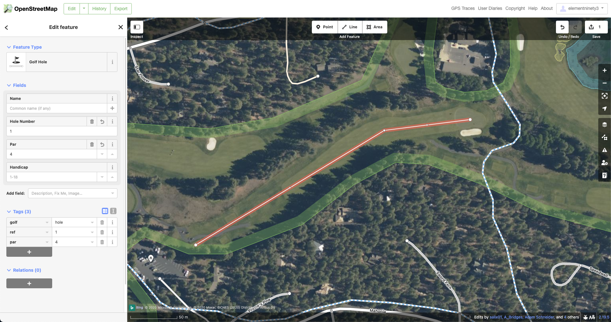

That's it! You're done mapping the hole's waypoints.

#### Step 2: Add hole features (fairway, green, tee boxes, sand traps)

Once you've defined where the hole is, you can add in the features you want to have drawn in your yardage book - like the fairway, the green, sand traps, etc. To do this, first click the ```Area``` button at the top of the screen in OSM:

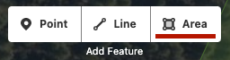

Next, draw a polygon around the feature you want to map:

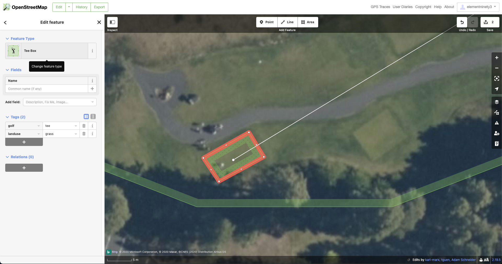

Finally, add the necessary information on the left side of the screen (see above at left). This will make sure the tool knows what type of feature this is. In this case, we've selected Tee Box, but you should select the appropriate feature for the feature you mapped (e.g. Fairway, Green, Bunker, etc).

*Note: many courses will already have bigger features like fairways and water hazards mapped. This is great because it saves time! Just remember to double check that these features have the proper information filled out (e.g. that the feature type is Golf - Fairway, or whatever is appropriate).*

#### Step 3: Add additional features (water hazards, trees, woods)

To add other features, click ```Area``` and map them just as described above. In order for the tool to recognize a water hazard, you should categorize it as Natural - Water:

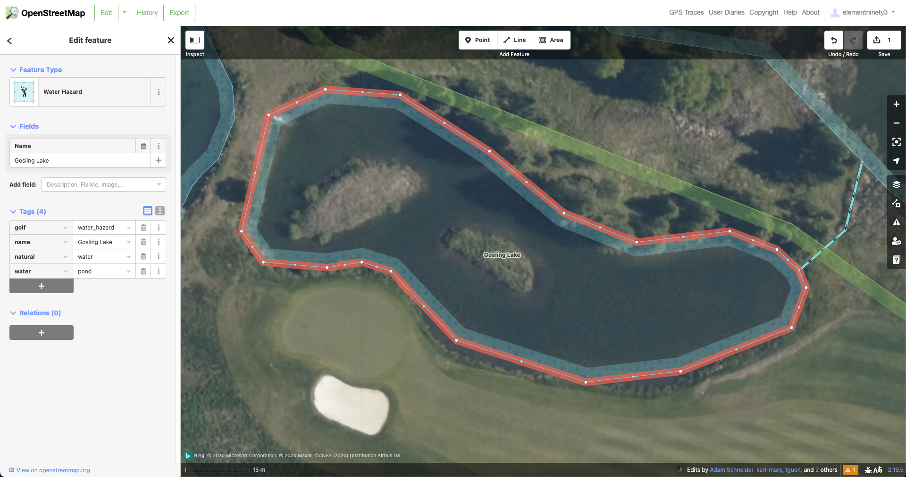

If you want to map woods so that they will show up in your yardage book, you can map them and categorize them as Natural - Wood:

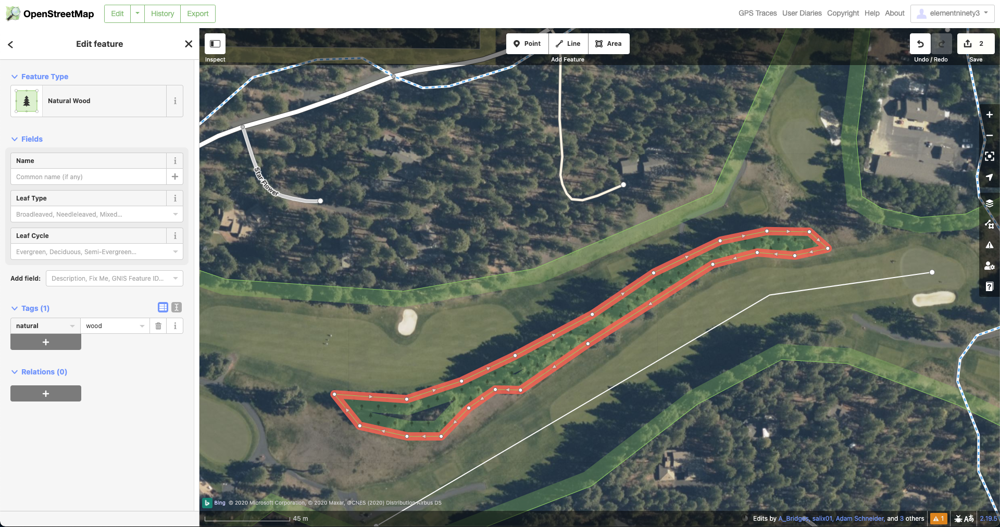

Finally, if you want to map an individual tree - one that is in the fairway, for example - click ```Point``` in OSM and mark the tree with a point. Then, categorize it as Natural - Tree:

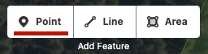
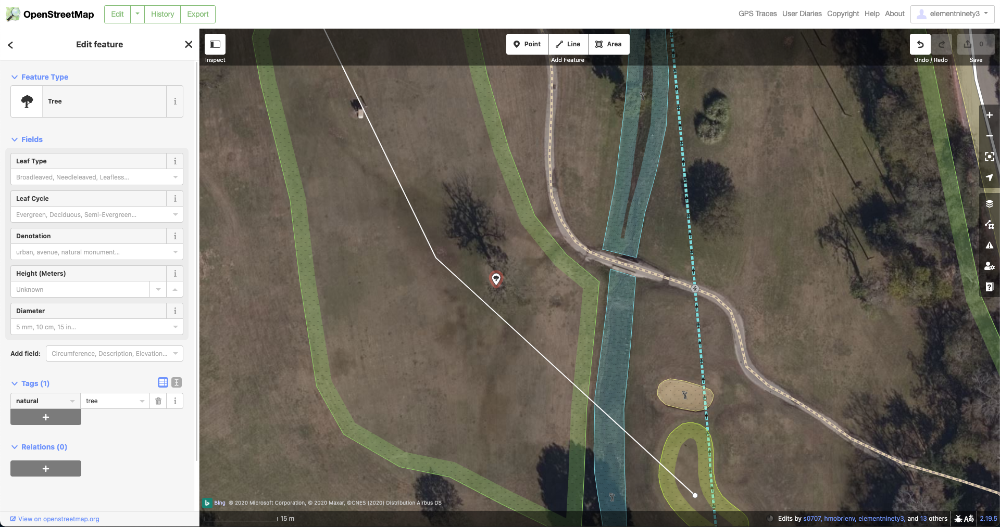

#### Step 4: Save changes

When you're done making changes, press the ```Save``` button in the upper right hand corner. This will upload your changes to the OpenStreetMap servers. (You don't need to save every time you make a change, but you may want to save every once in a while to avoid losing your work if you accidentally close the window.)

#### Step 5: repeat for every hole on your course

That's all there is to it! Once you've gotten the hang of it, you should be able to map courses fairly quickly - an 18-hole course usually takes me less than an hour while watching TV, and even less if some of the features have already been mapped. Just remember to define the waypoints of every hole properly - this is what the Hacker Yardage tool will use to determine exactly what to map.

Once you're done mapping the course, you can follow the steps in the [readme](readme.md) to generate a yardage book using the Hacker Yardage tool. **Please note:** it may take a few hours for your changes to be reflected in the data pulled by the Hacker Yardage tool. So if you map a course and then immediately try to generate a yardage book, some of the features may be missing. If this happens, simply wait a few hours (or maybe overnight) and then try again.
