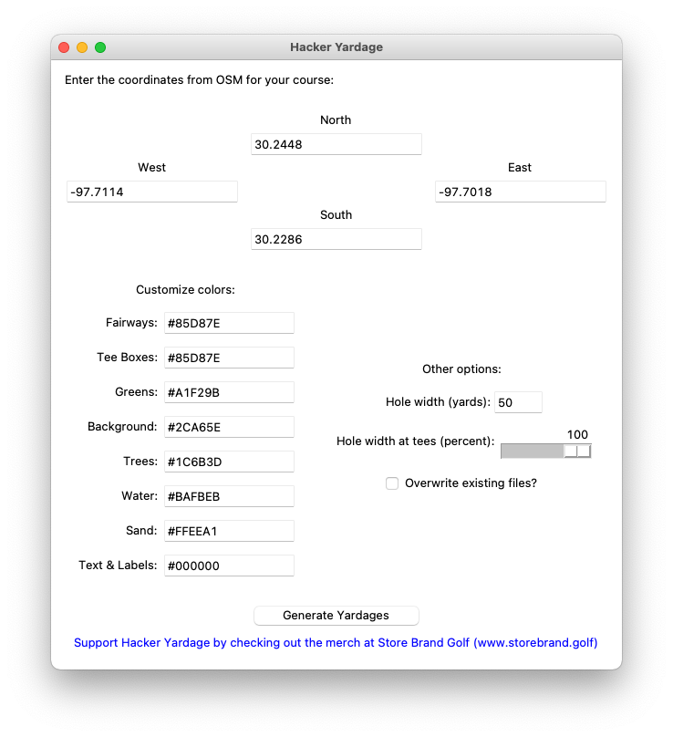
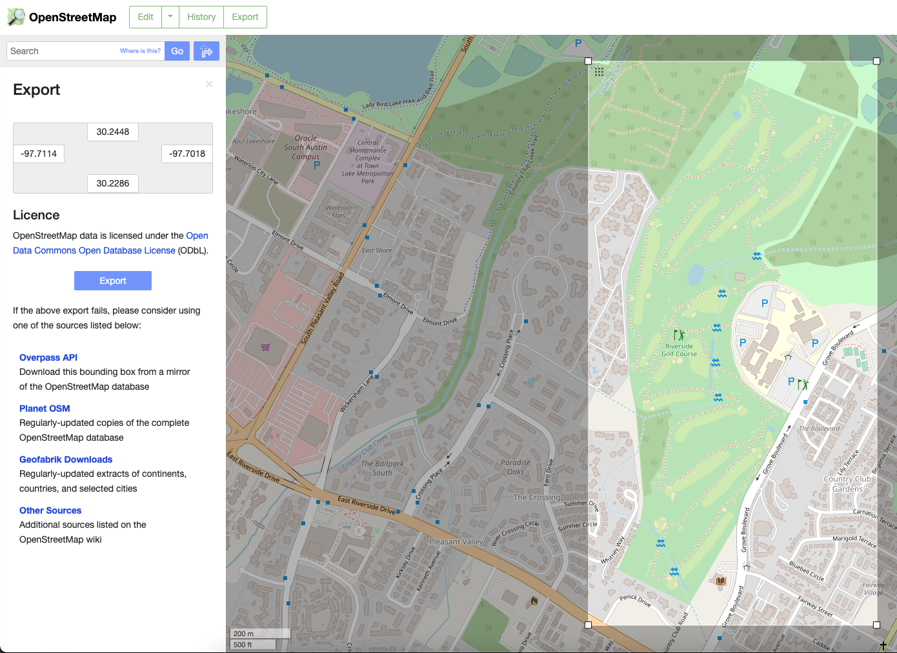
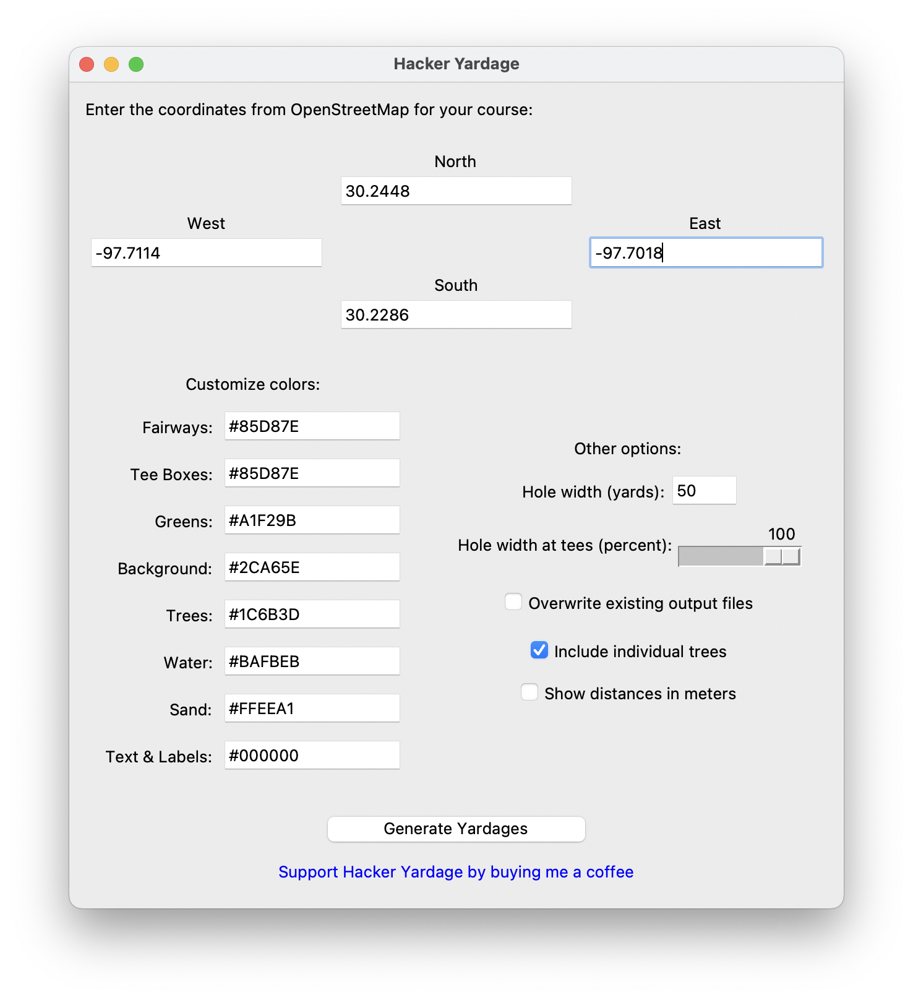
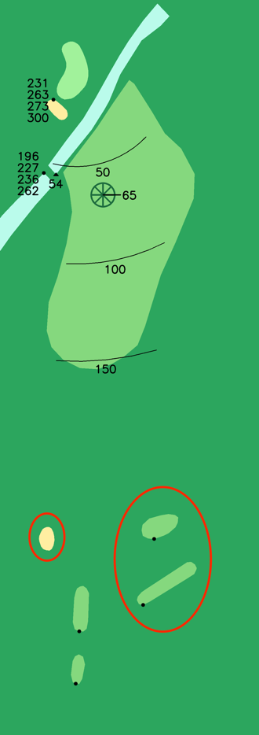
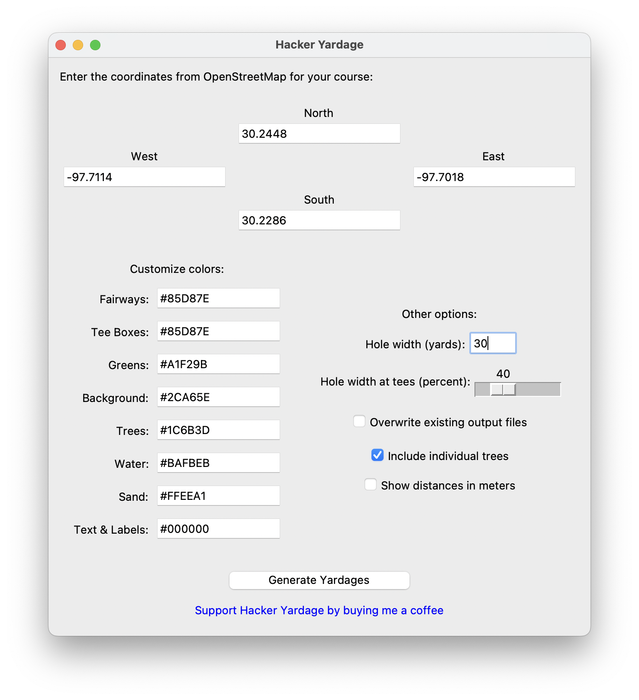

# Hacker Yardage

Thanks for checking out Hacker Yardage! This Python script should make it easy to create a yardage book for your favorite courses - see below for step-by-step instructions.

If you're new to Python, don't worry! I've tried to make this tool very simple to use, even for a novice. If you're an expert, there should be opportunities for you to play around a bit more.

If you use and like the tool, I'd appreciate your support by buying me a coffee. Or, you can check out the merchandise available at https://www.storebrand.golf/.


## Instructions

#### Step 1: get the Hacker Yardage tool running

You will need to have Python 3.6+ installed. You can find downloads from [the official Python website](https://www.python.org/downloads/).  

First, you'll need to download all the files in this repository. You can do that either by running ```git clone <link>```, or by downloading a zip file from the Github website.

Next, you'll need to install some packages, which are listed in ```requirements.txt```. You can do this quite easily by navigating to the project's home folder from the command line and running ```pip install requirements.txt```. (If you're running Python 3.6 or later, pip should be included.)

Once you have all the requirements installed, you can run the tool. From the command line, navigate to the project folder and run ```python3 hy-app.py```. (If you prefer to work with a script rather than the GUI, you can open up ```hy-script.py``` instead.)

If you are a true beginner and everything above looks like gibberish, try [this step-by-step guide](docs/setup.md) to get the tool up and running on your computer.



#### Step 2: map your course on OSM

For detailed instructions on how to do this properly, please see [this guide](docs/howtomap.md).

If you want to skip this step for now and test the tool on a course which has already been mapped, you can use Riverside Golf Course in Austin, TX - the coordinates are included as placeholders in the tool.


#### Step 3: get the coordinates

Once you have your course mapped properly in OpenStreetMaps, go to the Export screen.


Click the link that says ```Manually select a different area```. Then, draw a box that covers the entire area of the golf course you want to create a yardage book for. (If you want, you can draw a box around just one or two holes, but it's usually easier to do the whole course at once.)



Then, take the coordinates from OpenStreetMaps and enter them into the Hacker Yardage tool. (If you're using ```hy-script.py``` instead, enter the coordinates from OSM as the variables at the top of the file.)




#### Step 4: adjust custom options (if desired)

* To change the colors used to draw each element, replace the hex values on the left side of the screen.

* You can also choose whether you want to overwrite existing output files. (**Warning:** if using this option, make sure you have saved copies of any image files you want to keep somewhere outside of the ```output``` folder.)

* Sometimes, greens or sand traps are close enough to other holes that they get drawn along with that hole's features (see step 6 for an example). Usually, the default settings do a pretty good job for a first run, but if you want, you can adjust the hole width settings on the right side.

(If you're using ```hy-script.py``` instead, all of these options can also be adjusted as variables in that file.)

#### Step 5: generate the yardage book

When you're ready, click on the "Generate Yardages" button (or run ```python3 hy-script.py``` from the command line). It may take several minutes to complete the run.

Images will be generated and saved to the ```output``` folder. The image for the first hole will be named ```hole_1.png```, and so on for the rest of the holes. Green insets for each hole will be saved to the ```greens``` folder.

#### Step 6: fine-tune your results

After this first run, there might be a couple of holes that need some fine-tuning. For example, look at the yardages for Hole 2 at Riverside below - there are some extra tee boxes and sand traps from another hole showing up (circled in red). The tee boxes are a particular problem, because they give us a bunch of extra carry distances we don't need.

\

We can clean this up easily. To re-run just this one hole, first we need to delete ```hole_2.png``` from the output folder:

/insert deleted hole 2

Then, we need to adjust the hole width settings. I'll make the hole width a little narrower at 35 yards, and filter extra-aggressively near the tee box by changing that filter to 40%.



Finally, click the ```Generate Yardages``` button one more time. The tool will skip hole 1 and holes 3-18, since there are already images in the ```output``` folder for all of those holes. However, it will re-run Hole 2 for us, and the results should look much better:


## Printing

Once you've got all the imagery generated, you can print out a yardage book! To get you started, I've included a template you can use.

I've personally had success printing out this template on legal-size paper, with double-sided printing enabled on the long edge. Then, I cut the printed pages in half using a straight edge and a utility knife. Finally, I folded all the pages in half and stapled them at the seam to make a pretty sharp-looking book.
